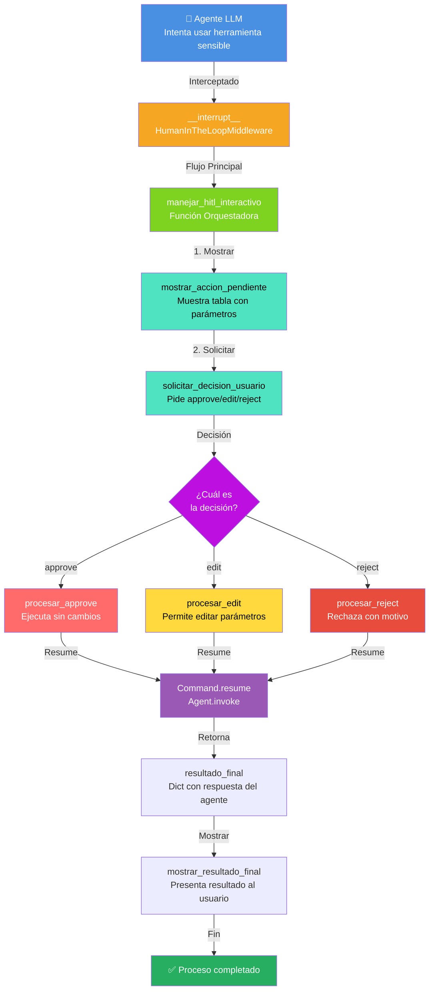
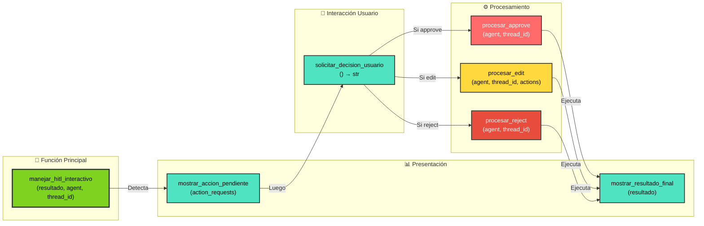
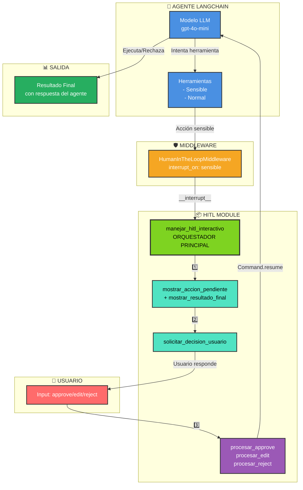
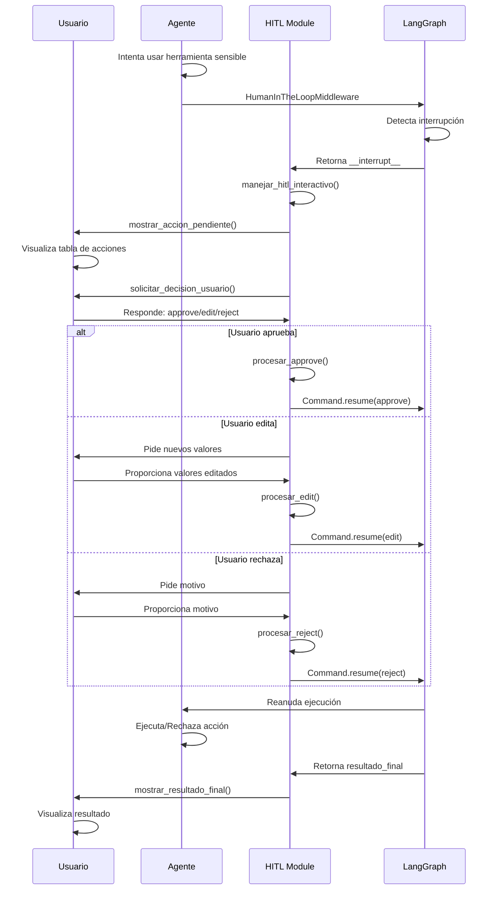

# Human-in-the-Loop (HITL) Interaction Module

Módulo reutilizable para manejar la interacción con el usuario en flujos de Human-in-the-Loop con LangChain.

## Descripción

El módulo `hitl_interaction.py` proporciona funciones para:

1. **Mostrar acciones pendientes** del agente de forma clara y estructurada
2. **Solicitar decisiones** del usuario (approve, edit, reject)
3. **Procesar cada tipo de decisión** con la lógica correspondiente
4. **Mostrar resultados finales** de forma formateada

## Diagrama de Flujo de Funciones



## Diagrama de Funciones y Dependencias



## Funciones Disponibles

### `manejar_hitl_interactivo(resultado_inicial, agent, thread_id)`

Función principal que maneja todo el flujo HITL de forma interactiva.

**Parámetros:**
- `resultado_inicial` (Dict): Resultado de la invocación inicial del agente
- `agent`: El agente de LangChain
- `thread_id` (str): ID del thread para la ejecución

**Retorna:**
- Dict: Resultado final después de la decisión del usuario
- None: Si no hay acciones pendientes

**Ejemplo:**
```python
from scripts.agents.tools.hitl_interaction import manejar_hitl_interactivo

resultado = agent.invoke(
    {"messages": [{"role": "user", "content": "..."}]},
    config={"configurable": {"thread_id": "demo-001"}}
)

resultado_final = manejar_hitl_interactivo(
    resultado_inicial=resultado,
    agent=agent,
    thread_id="demo-001"
)
```

### `mostrar_accion_pendiente(action_requests)`

Muestra información estructurada sobre las acciones pendientes en una tabla formateada.

**Parámetros:**
- `action_requests` (list): Lista de acciones pendientes del agente

### `solicitar_decision_usuario()`

Solicita al usuario que elija entre approve, edit o reject.

**Retorna:**
- str: La decisión del usuario

### `procesar_approve(agent, thread_id)`

Procesa la decisión de aprobación.

**Parámetros:**
- `agent`: El agente de LangChain
- `thread_id` (str): ID del thread

**Retorna:**
- Dict: Resultado de la ejecución

### `procesar_edit(agent, thread_id, action_requests)`

Procesa la decisión de edición, permitiendo modificar parámetros.

**Parámetros:**
- `agent`: El agente de LangChain
- `thread_id` (str): ID del thread
- `action_requests` (list): Lista de acciones pendientes

**Retorna:**
- Dict: Resultado de la ejecución

### `procesar_reject(agent, thread_id)`

Procesa la decisión de rechazo.

**Parámetros:**
- `agent`: El agente de LangChain
- `thread_id` (str): ID del thread

**Retorna:**
- Dict: Resultado de la ejecución

### `mostrar_resultado_final(resultado)`

Muestra el resultado final de la ejecución del agente.

**Parámetros:**
- `resultado` (Dict): Resultado del agente

## Ejemplo Completo

Ver `class2-E2.py` para un ejemplo completo de uso.

```python
from langchain.agents import create_agent
from langchain.agents.middleware import HumanInTheLoopMiddleware
from langchain.chat_models import init_chat_model
from langgraph.checkpoint.memory import InMemorySaver
from scripts.agents.tools.hitl_interaction import (
    manejar_hitl_interactivo,
    mostrar_resultado_final,
)

# Crear agente con HITL middleware
agent = create_agent(
    model=init_chat_model("openai:gpt-4o-mini"),
    tools=[mi_herramienta_sensible],
    middleware=[
        HumanInTheLoopMiddleware(
            interrupt_on={
                "mi_herramienta_sensible": {
                    "allowed_decisions": ["approve", "edit", "reject"]
                }
            }
        )
    ],
    checkpointer=InMemorySaver(),
)

# Invocar agente
resultado = agent.invoke(
    {"messages": [{"role": "user", "content": "..."}]},
    config={"configurable": {"thread_id": "demo-001"}}
)

# Manejar interacción HITL
resultado_final = manejar_hitl_interactivo(
    resultado_inicial=resultado,
    agent=agent,
    thread_id="demo-001"
)

# Mostrar resultado
if resultado_final:
    mostrar_resultado_final(resultado_final)
```

## Características

- ✅ Interfaz interactiva clara con colores
- ✅ Tablas formateadas para mostrar acciones
- ✅ Soporte para approve, edit y reject
- ✅ Edición de parámetros con valores por defecto
- ✅ Manejo de errores y validación
- ✅ Completamente reutilizable en otros scripts
- ✅ Funciones granulares para máxima flexibilidad

## Diagrama de Arquitectura Completa



## Casos de Uso

### 1. **Aprobación Simple (Approve)**
```
Usuario ve acción → Presiona 'approve' → Se ejecuta tal cual → Resultado final
```

### 2. **Edición de Parámetros (Edit)**
```
Usuario ve acción → Presiona 'edit' → Modifica parámetros → Se ejecuta editada → Resultado final
```

### 3. **Rechazo (Reject)**
```
Usuario ve acción → Presiona 'reject' → Especifica motivo → Se rechaza → Respuesta del agente sobre rechazo
```

## Flujo de Control Detallado



## Dependencias

- `langchain`
- `langgraph`
- `rich` (para formateo de salida)
